# perflab_code

## Работа с web http

### Настройка **IntelliJ IDEA**

Перейти в раздел

File | Settings | Build, Execution, Deployment | Build Tools | Maven

1. В главном меню выбрать **File**/**Settings** (*Ctrl+Alt+S*).
2. В поисковой строке окна "Settings" ввести `maven`. 
3. Перейти в раздел **Build, Execution, Deployment** > **Build Tools** > **Maven**

Если в поле **Maven Home Directory** выбрано значение `Bundled (Maven 3)`. 
И версия ниже, чем 3.5.2, например: `(Version: 3.3.9)`.
То нужно выбрать путь к новому **maven** из выпадающего списка.

Например:


| **Maven Home Directory** | /usr/share/maven |
|---|---|
| | (Version: 3.6.0) |


### Открытие проекта в графическом режиме из IDEA

Выбрать в разделе maven пункт: jmeter:gui

* jmeter-web | Plugins | jmeter | jmeter:gui

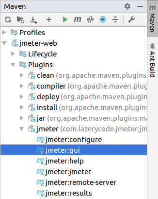

Если при запуске проекта из **IntelliJ IDEA** была получена ошибка

```
[ERROR] Failed to execute goal com.lazerycode.jmeter:jmeter-maven-plugin:2.9.0:gui (default-cli) on project jmeter-web: The plugin com.lazerycode.jmeter:jmeter-maven-plugin:2.9.0 requires Maven version 3.5.2 -> [Help 1]
[ERROR] 
[ERROR] To see the full stack trace of the errors, re-run Maven with the -e switch.
[ERROR] Re-run Maven using the -X switch to enable full debug logging.
[ERROR] 
[ERROR] For more information about the errors and possible solutions, please read the following articles:
[ERROR] [Help 1] http://cwiki.apache.org/confluence/display/MAVEN/PluginIncompatibleException
```

То надо использовать версию **maven** новее.
Смотри раздел "Настройка **IntelliJ IDEA**" выше.

### Открытие проекта в графическом режиме из консоли

Выполнить команду

```
mvn jmeter:gui
```

# Добавление CSV Data Set Config

В файле pom.xml настроена передача свойства **data.dir** в сценарий:

```xml

    <propertiesUser>
        <data.dir>${project.basedir}/src/test/jmeter/data</data.dir>
    </propertiesUser>
```

Чтобы было проще использовать значение свойства в корневом разделе скрипта,
в разделе "User Defined Variables" значение свойства **data.dir**
копируется в переменную **data.dir**. Используя функцию __P():


| Name: | Value |
|---|---|
| data.dir | ${__P(data.dir)} |


Добавим загрузку файлов из каталога

src/test/jmeter/data в скрипт.

Чтобы посмотреть заголовки файлов удобно выполнить команду head:

```
$ head -n 1 *
==> comments_20k_seed1.csv <==
"ID","Date","Text"

==> posts_5k_seed1.csv <==
"ID","Date","Title","Tags","Body"

==> user_1k.csv <==
"login","first_name","last_name","email","password"

==> users_100.csv <==
"login","first_name","last_name","email","password"
```

**CSV Data Set Config** необходимы со значениями:


| Name | Comment | Filename | 
|---|---|---|
| CSV Data Set Config: comments  | "ID","Date","Text" | ${data.dir}/comments_20k_seed1.csv |
| CSV Data Set Config: posts  | "ID","Date","Title","Tags","Body" | ${data.dir}/posts_5k_seed1.csv |
| CSV Data Set Config: user  | "login","first_name","last_name","email","password" | ${data.dir}/users_100.csv |


и настройками:


| Настройка | Значения |
|---|---|
| File encoding | **UTF-8** |
| Variables name (comma-delimeted) | |
| Ignore first line | False |
| Delimiter | , |
| Allow quoted data? | **True** |
| Recycle on EOF? | True |
| Stop thread on EOF? | False |
| Sharing mode | All threads|

После добавления трёх **CSV Data Set Config** и переменной с путём к каталогу с данными
скрипт станет таким:

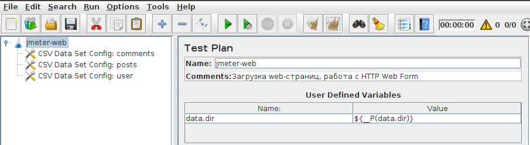 

Чтобы сразу просмотреть скрипт с настройенными **CSV Data Set Config**
можно выполнить команду:

```
mvn jmeter:gui -Djmx=jmeter-web.1
```

# Добавление HTTP Header Manager

**JMeter**: добавим в тест конфигурационный элемент **HTTP Header Manager**:

Add | Config Elements | HTTP Header Manager

По умолчанию состав заголовков пустой.
Заголовки запроса удобно скопировать из консоли браузера.

**Mozilla**: в браузере **Mozilla** открыть консоль разработчика (F12), перейти на вкладку
"Network" ("Сеть").

Открыть контекстное меню на запросе (любом), например, на хапросе главной страницы сайта
<http://wp.loadlab.ragozin.info/>

В контектном меню выбрать пункты

Копировать / Копировать заголовки запроса

**JMeter**: в **HTTP Header Manager** нажать кнопку **Add from Clipboard**

В результате добавится много заголовков, достаточно оставить лишь 4:


| Name: | Value |
|---|---|
| User-Agent | Mozilla/5.0 (X11; Ubuntu; Linux x86_64; rv:66.0) Gecko/20100101 Firefox/66.0 |
| Accept | text/html,application/xhtml+xml,application/xml;q=0.9,*/*;q=0.8 |
| Accept-Language | ru-RU,ru;q=0.8,en-US;q=0.5,en;q=0.3 |
| Accept-Encoding | gzip, deflate |

Остальные строки удалить нажатием кнопки **Delete**.

**HTTP Header Manager** нужен, чтобы сервер считал нас современным браузером.
И отдавал релевантное содержимое. Так, например, если статику в сжатом виде (gzip)
или разбивая ответы на части (chunked).

Чтобы сразу просмотреть скрипт с настройенными **HTTP Header Manager**
можно выполнить команду:

```
mvn jmeter:gui -Djmx=jmeter-web.2
```

# Добавление HTTP Cookie Manager

**JMeter**: добавим в тест конфигурационный элемент **HTTP Cookie Manager**:

Add | Config Elements | HTTP Cookie Manager

По умолчанию состав настроек такой:


| Настройка | Значение |
|---|---|
| Clear Cookies Each Iteration | Нет |
| Cookie Policy | standard |
| User-Defined Cookies | Пусто |

Рекомендуемые значения Cookie Policy это:

| Cookie Policy | Описание |
|---|---|
| standard | соотвествие https://tools.ietf.org/html/rfc6265 не включая секцию 4 |
| standard-strict | строгое соотвествие https://tools.ietf.org/html/rfc6265#section-4 |

Для сценария, где пользователь каждый раз выполняет аутентификацию
нужно очищать Cookie каждую итерацию.

У нас задуман именно такой сценарий. Отметим настройку 

| Настройка | Значение |
|---|---|
| Clear Cookies Each Iteration | `[v]` |

Чтобы сразу просмотреть скрипт с настроенным **HTTP Cookie Manager**
можно выполнить команду:

```
mvn jmeter:gui -Djmx=jmeter-web.3
```

# Добавление HTTP Cache Manager

**JMeter**: добавим в тест конфигурационный элемент **HTTP Cache Manager**:

Add | Config Elements | HTTP Cache Manager

Элемент **HTTP Cache Manager** нужен для кеширования статики на стороне Apache.JMeter.

Поведение современных браузеров отличается от поведения Apache.JMeter
при работе с кешированными запросами:

* Apache.JMeter отправит на сервер запрос, указав, что в кеше имеет актуальную версию ответа и получит ответ **204 No Content** или **304 Not Modified**.
* Браузер при наличии кеша ответа сервера не отправляет запрос к серверу вообще.

По умолчанию задано кеширование только ответов на метод GET:

```
#---------------------------------------------------------------------------
# HTTP Cache Manager configuration
#---------------------------------------------------------------------------
#
# Space or comma separated list of methods that can be cached
#cacheable_methods=GET
```

Чтобы разрешить кеширование ответов на HEAD-, POST-, ... запросы нужно изменить
настройку cacheable_methods.

Чтобы сразу просмотреть скрипт с добавленным **HTTP Cache Manager**
можно выполнить команду:

```
mvn jmeter:gui -Djmx=jmeter-web.4
```

# Добавление HTTP Request Defaults


**JMeter**: добавим в тест конфигурационный элемент **HTTP Request Defaults**:

Add | Config Elements | HTTP Request Defaults

HTTP Request Defaults позволяет задавать настройки по умолчанию для 
HTTP Request. Например:

Server Name or IP: `wp.loadlab.ragozin.info`

На вкладке "Advansed" настраивается возможность загрузки статических
ресурсов.

* `[v]` Retrieve All Embedded Resources
* `[v]` Parallel Download Number: `6     `
* URLs must match: `http://wp\.loadlab\.ragozin\.info.*`


Также на вкладке "Advansed" настраивается возможность работы через Proxy:

Proxy Server

| Server Name or IP | Port Number |
|---|---|
| localhost | 8888 |

Блок настроек с локальным Proxy Server удобно создать, отключить и включать
при необходимости отладки сценария.

Чтобы сразу просмотреть скрипт с добавленным **HTTP Request Defaults**
можно выполнить команду:

```
mvn jmeter:gui -Djmx=jmeter-web.5
```


# Thread Group

В Thread Group задаётся количество пользователей, выполняемые ими итерации.
Поведение при ошибках.

Так если нужно создать сценарий в котором выполнится 100 сценариев:

* 20 потоков по 5 итераций каждый, то нужны настройки:
    * Threads: 20
    * Loop Count: 5
    
Если добавить в катушку пока просто пустой Transaction Controller (TC: Create Post),
в котором разместить 6 Simple Controller (по выполняемым шагам), то получится так:

* Thread Group
    * TC: Create Post
        * Стартовая страница
        * Форма аутентификации
        * Аутентификация
        * Нажать кнопку New/Post
        * Опубликовать Post
        * Посмотреть Post
        
 По форме, текущая нагрузка выглядит так:
 
 * 20 потоков
 * 5 итераций
 * 6 запросов в сценарии
 * без пауз
 

 
 Чтобы контроллировать количество операций в единицу времени нужно вставить
 таймер между двумя выполнениями **TC: Create Post**:
 
 Добавить в сценарий, например, связку из:
 
 * Flow Control Action
    * Constant Throughput Timer
    
 А чтобы визуально отличать в результатах сценарий с паузами:
 
 1. Выделить в скрипте транзакцию **TC: Create Post**
 2. В контектном меню выбрать Insert Parent / Login Controller / Transaction Controller
 3. Задать для нового **Transaction Controller** свойство `[v]` Include duration of timer 
 3. Задать для нового **Transaction Controller** имя  `TC: Create Post`
 
 Структура сценария получилась такой:
 
 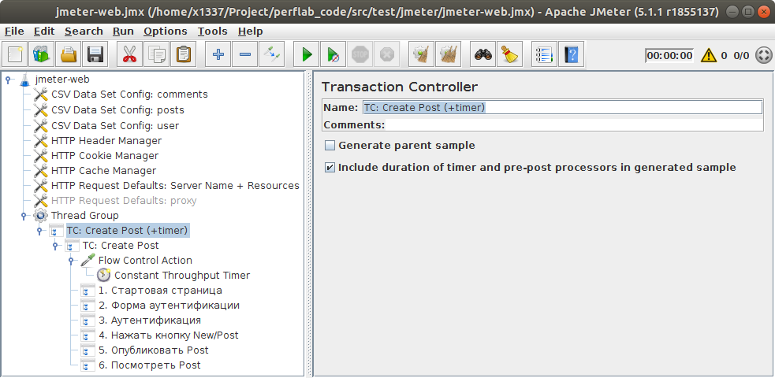
 
 Теперь изменяя настройки **Constant Throughput Timer** можно контроллировать
 количество сценариев в единицу времени. И по форме нагрузка стала такой:
 
По форме, текущая нагрузка теперь выглядит так:
 
 * 20 потоков
 * 5 итераций
 * 6 запросов в сценарии
 * с фиксированными интервалами времени между запусками
 
 

Чтобы сразу просмотреть скрипт с добавленным **Thread Group**
можно выполнить команду:

```
mvn jmeter:gui -Djmx=jmeter-web.6
```

# Добавление Listener-ов

Осталось самое простое:

1. Добавить в сценарий Listener-ы:
    * View Results Tree
    * Summary Report
    * Aggregate Report
2. Запустить тест

Если в таймере **Constant Throughput Timer**
значение интенсивности между итерациями было выставлено таким образом:

* Target throughput (in samples per minute): 3.0
* Calculate throughput based on: this thread only

То чтобы один сценарий выполнился 3 раза на минуту (60 сек) длительность
транзакции с таймером должна будет расчитаться так, чтобы составить 20 сек.

И результаты покажут результат именно в 20 сек для **TC: Create Post (+timer)**

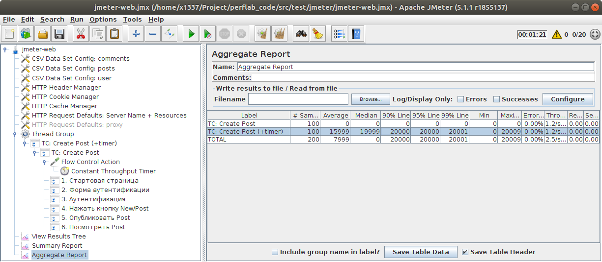

Чтобы сразу просмотреть скрипт с добавленным **View Results Tree**, **Summary Report**, **Aggregate Report**
можно выполнить команду:

```
mvn jmeter:gui -Djmx=jmeter-web.7
```

# Перенос запросов в сценарий из har-лога

На данный момент у нас готов шаблонный тест. В нём не хватает самого главного -- запросов.

Чтобы быстро перенести запросы из har-лога, который можно сохранить в браузере, в скрипт JMeter удобно воспользоваться инструментами:

* Fiddler
* компонентом **HTTP(S) Test Script Recorder**

## Настройка Fiddler

1. Запустить инструмент Fiddler
    * `Fiddler.exe`
    * `mono Fiddler.exe`
    * `mono --arch32 Fiddler.exe`
2. Отключить в левом нижнем углу процесс перехвата трафика кликнув по слову **Captured**.
3. Открыть диалог настроек из главного меню: Tools / Options
4. В диалоге "Options" перейти на вкладку "Connections" и снять галочку `[ ]` Act as system proxy on startup
4. В диалоге "Options" перейти на вкладку "Gateway" и в поле **Manual Proxy Configuration** установить значение `http=localhost:9999;https=localhost:9999;`
5. Нажать кнопку **OK**

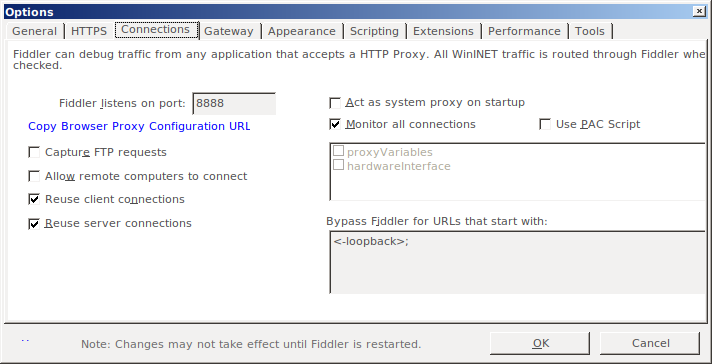

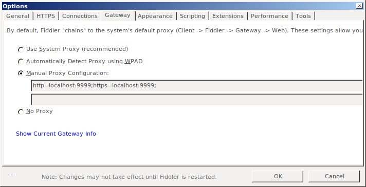

## Настройка **HTTP(S) Test Script Recorder**

Добавить в сценарий **HTTP(S) Test Script Recorder**:

* Add / Non-Test Elements / HTTP(S) Test Script Recorder

В поле **Port** указать порт, который будет слушать **HTTP(S) Test Script Recorder**:

* `9999`

В поле Target Controller указать куда будут записываться запросы: 

* jmeter-web > Thread Group > TC: Create Post (+timer) > TC: Create Post > 1. Стартовая страница

Нажать кнопку **Start**.

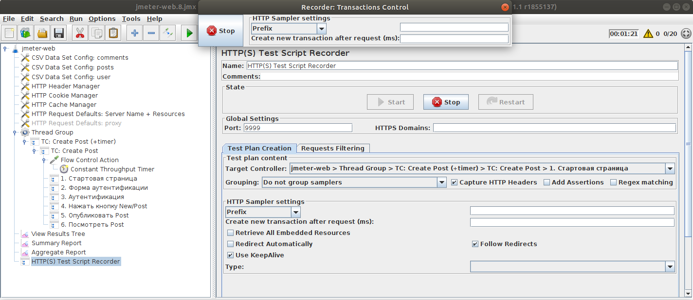

Чтобы сразу просмотреть скрипт с добавленным **HTTP(S) Test Script Recorder**
можно выполнить команду:

```
mvn jmeter:gui -Djmx=jmeter-web.8
```

## Отправка запросов из Fiddler в **HTTP(S) Test Script Recorder**

Чтобы отправить запросы из **Fiddler** в **HTTP(S) Test Script Recorder** нужно:

1. Выделить нужный запрос
2. Нажать клавишу R (переотправить)

В этом случае **Fiddler** будет переотправлять сохранённый в браузере запрос в **JMeter**:

* отправит его через прокси сервер `http=localhost:9999;https=localhost:9999;`
* на localhost:9999 слушает сообщения прокси-сервер **HTTP(S) Test Script Recorder**
* который сохранит полученные запросы в `jmeter-web > Thread Group > TC: Create Post (+timer) > TC: Create Post > 1. Стартовая страница` или в другую выбранную группу.

Таким образом можно сценарий любой сложности быстро перенести из браузера в **JMeter**.

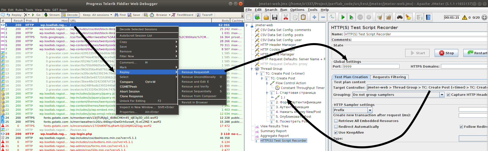

Заранее подготовленные HTTP Archive-файлы есть в каталоге HTTP.Archive:

1. Archive 19-05-20 21-17-12.Home.Page.har
2. Archive 19-05-20 21-17-47.Login.Form.har
3. Archive 19-05-20 21-18-15.Authentification.har
4. Archive 19-05-20 21-18-42.New.Post.Action.har
5. Archive 19-05-20 21-20-04.Publish.Post.har
6. Archive 19-05-20 21-20-23.Vew.Post.har
7. Archive 19-05-20 21-20-43.Comment.har

А заранее подготовленный файл в формате Fiddler также сохранён в каталоге HTTP.Archive:

1. Archive.saz

Чтобы сразу просмотреть скрипт с добавленнымы **HTTP Request**
можно выполнить команду:

```
mvn jmeter:gui -Djmx=jmeter-web.9
```

# Корреляция запросов

Если сейчас выполнить сценарий, то мы получим ошибку:


Открыть понтектное меню на **Thread Group** и выбрать пункт **Validate** -- выполнится одна итерация сценария.

5-й запрос завершился ошибкой:

* POST http://wp.loadlab.ragozin.info/wp-admin/post.php
* HTTP/1.1 403 Forbidden

```
    <body id="error-page">
    	<p>The link you followed has expired.</p>
    	<p><a href="/wp-admin/post-new.php">Please try again.</a></p>
    </body>

```

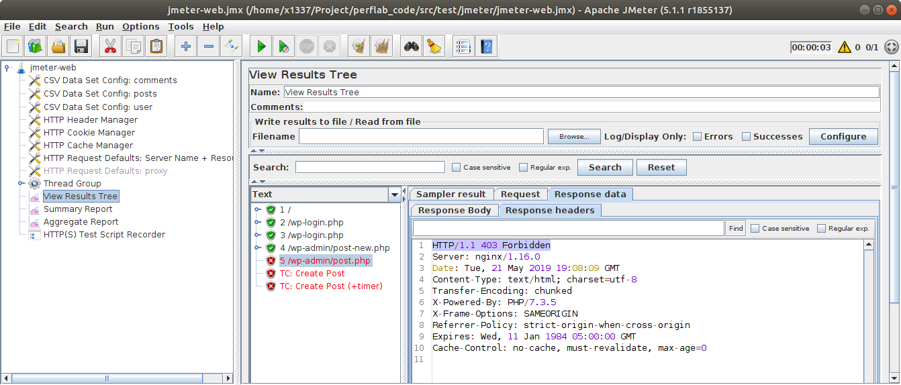

Всё потому, что в параметрах запроса 5 большое количество магических контант:

* _wpnonce: 780c104f36
* meta-box-order-nonce: c81d0bbc7b
* ...

которые нужно скоррелировать. Сделать так, чтобы их значения брались из ответов на предыдущие запросы.
Для точной эмуляции работы клиента.

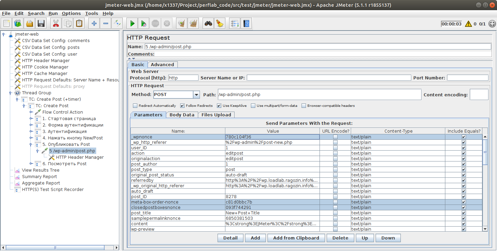

Для поиска источника значений удобно использовать Fiddler, где есть полнотекстовый поиск по всему трафику:

Так значение `780c104f36` которое нужно скоррелизовать в 5-м запросе пришло нам в ответе на 4-й запрос.

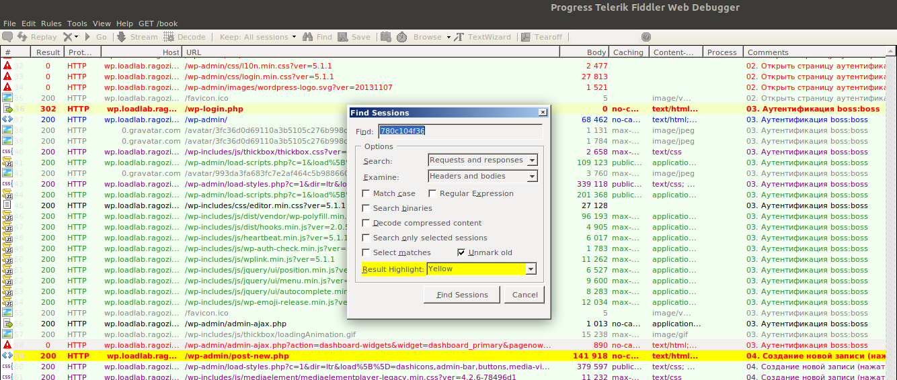

Ответ на 4-й запрос (59-я строка в Fiddler) можно посмотреть в Fiddler или например открыть в тектостовом редакторе или в браузере:

* <a href="HTTP.Archive/Resp.Body/59.wp-admin.post-new.php.htm" target="59" >HTTP.Archive/Resp.Body/59.wp-admin.post-new.php.htm</a>

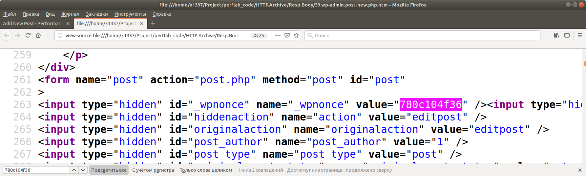

## Получение _wpnonce (корреляция)

Находим наше значение

```

    <input type="hidden" id="_wpnonce" name="_wpnonce" value="780c104f36" />
```

Значит, если добавить к **4 /wp-admin/post-new.php** PostProcessor  **CSS Selector Extractor** с выражением `input#_wpnonce`, то в аттрибуте `value` будет искомое значение `780c104f36`.

И теперь можно в 5-м запросе использовать вместо константы переменную `${_wpnonce}`

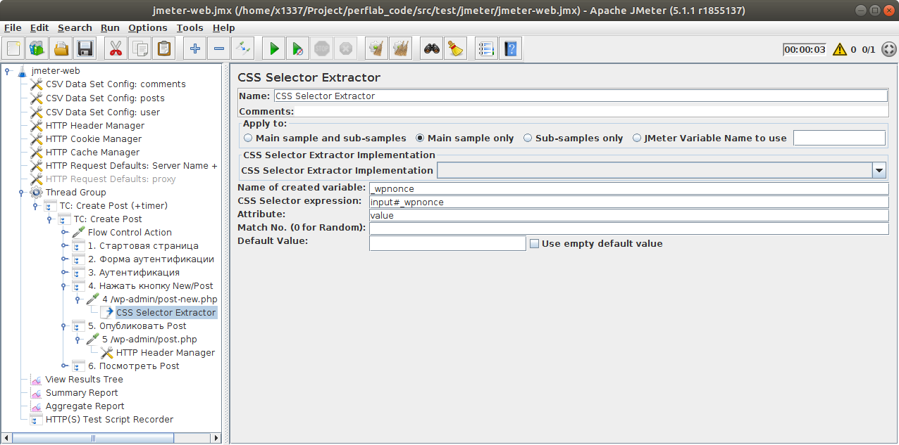

Чтобы сразу просмотреть скрипт с корреляцией **_wpnonce**
можно выполнить команду:

```
mvn jmeter:gui -Djmx=jmeter-web.10
```

## Получение других параметров (корреляция)


| Параметр | Исходное значение | CSS-селектор для 4-го запроса | Аттрибут |
|---|---|---|---|
| _wpnonce | 780c104f36 | `input#_wpnonce` | value |
| user_ID | 1 | `input#user-id` | value |
| post_author | 1 | `input#post_author` | value |
| post_ID | 8278 | `input#post_ID` | value |
| meta-box-order-nonce | c81d0bbc7b | `input#meta-box-order-nonce` | value |
| samplepermalinknonce | 6850381503 | `input#samplepermalinknonce` | value |
| _ajax_nonce-add-category | ddc93a11c3 | `input#_ajax_nonce-add-category` | value |
| closedpostboxesnonce | 093f744291 | `input#closedpostboxesnonce` | value |
| _ajax_nonce-add-meta |  | `input#_ajax_nonce-add-meta` | value |
| post_author_override | 1 | `select#post_author_override > option[selected=selected]` | value (не надо использовать!!!) |


Как видно, все селекторы очень простые.


Параметры для удаления (дата публикации):
```
mm	05	false	text/plain	true
jj	20	false	text/plain	true
aa	2019	false	text/plain	true
hh	15	false	text/plain	true
mn	48	false	text/plain	true
ss	56	false	text/plain	true
hidden_mm	05	false	text/plain	true
cur_mm	05	false	text/plain	true
hidden_jj	20	false	text/plain	true
cur_jj	20	false	text/plain	true
hidden_aa	2019	false	text/plain	true
cur_aa	2019	false	text/plain	true
hidden_hh	15	false	text/plain	true
cur_hh	15	false	text/plain	true
hidden_mn	48	false	text/plain	true
cur_mn	48	false	text/plain	true
```

Чтобы сразу просмотреть скрипт с корреляцией всех параметров запроса 4
можно выполнить команду:

```
mvn jmeter:gui -Djmx=jmeter-web.11
```

## Заголовок статьи (корреляция)

Сейчас открытие записи блога выглядит так:

* 6 /2019/05/20/new-post-title/

обращение по фиксированному пути.

Чтобы скоррелировать работу 6-го запроса, нужно понять где можно найти сгенерированный URL новой записи.

Fiddler подсказывает, что URL есть в ответе на 5-й запрос (Сохранить запись в блоге)

* <a href="HTTP.Archive/Resp.Body/127.wp-admin.post.php.htm" target="127" >HTTP.Archive/Resp.Body/127.wp-admin.post.php.htm</a>

Это текст:

```
    
    <div id="message" class="updated notice notice-success is-dismissible">
    <p>Post published. 
        <a href="http://wp.loadlab.ragozin.info/2019/05/20/new-post-title/">View post</a>
    </p>
    </div>
```

нам подойдет селектор:

* Name: `newPostUrl`
* Selector: `div#message.updated.notice.notice-success.is-dismissible a`
* Attribute: `href`

Чтобы сразу просмотреть скрипт с корреляцией **newPostUrl**
можно выполнить команду:

```
mvn jmeter:gui -Djmx=jmeter-web.12
```

Теперь скрипт полностью связан одним процессом. Но он создаёт пост с фиксированнм содержимым.

## Параметризация запросов (логин и пароль, заголовок и текст записи)

Чтобы параметрировать текст, заголовок, логин и пароль пользователя можно
воспользоваться переменными:

* 3 /wp-login.php:
    * log = ${login}
    * pwd = ${password}
* 5 /wp-admin/post.php
    * post_title = ${Title}
    * content = ${Body}
    
Чтобы сразу просмотреть скрипт с параметризацией
можно выполнить команду:

```
mvn jmeter:gui -Djmx=jmeter-web.13
```

Теперь скрипт полностью готов.

Можно запускать:

```
mvn jmeter:jmeter
```

Чтобы запустить тест через локальный прокси на localhost:8888 (для отладки) можно выполнить команду:

```
mvn jmeter:jmeter -P proxy
```