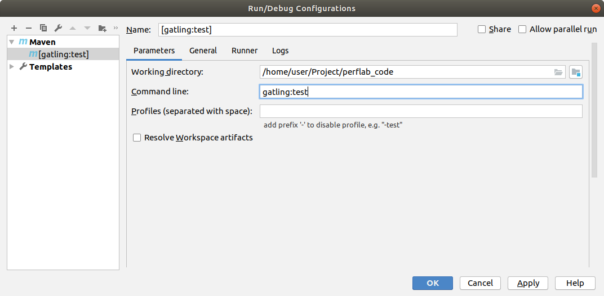

# perflab_code

## Проект Gatling для IDEA

### Создание проекта

Проект создаётся автоматически с помощью gatling maven archetype.

Команда для создания проекта

```
mvn archetype:generate -DarchetypeGroupId=io.gatling.highcharts -DarchetypeArtifactId=gatling-highcharts-maven-archetype
```
В ходе генерации заполняются поля
* io.github.polarnik -- пространство имён, которое как-то указывает на вас или ваш проект.
* gatling-project-idea -- название проекта
* 0.1.0 -- версия

Пример выполнения:

```
[INFO] Scanning for projects...
[INFO] 
[INFO] ------------------< org.apache.maven:standalone-pom >-------------------
[INFO] Building Maven Stub Project (No POM) 1
[INFO] --------------------------------[ pom ]---------------------------------
[INFO] 
[INFO] >>> maven-archetype-plugin:3.0.1:generate (default-cli) > generate-sources @ standalone-pom >>>
[INFO] 
[INFO] <<< maven-archetype-plugin:3.0.1:generate (default-cli) < generate-sources @ standalone-pom <<<
[INFO] 
[INFO] 
[INFO] --- maven-archetype-plugin:3.0.1:generate (default-cli) @ standalone-pom ---
[INFO] Generating project in Interactive mode
[INFO] Archetype [io.gatling.highcharts:gatling-highcharts-maven-archetype:3.1.2] found in catalog remote
Downloading from central: https://repo.maven.apache.org/maven2/io/gatling/highcharts/gatling-highcharts-maven-archetype/3.1.2/gatling-highcharts-maven-archetype-3.1.2.pom
Downloaded from central: https://repo.maven.apache.org/maven2/io/gatling/highcharts/gatling-highcharts-maven-archetype/3.1.2/gatling-highcharts-maven-archetype-3.1.2.pom (7.2 kB at 46 kB/s)
Downloading from central: https://repo.maven.apache.org/maven2/io/gatling/highcharts/gatling-highcharts-maven-archetype/3.1.2/gatling-highcharts-maven-archetype-3.1.2.jar
Downloaded from central: https://repo.maven.apache.org/maven2/io/gatling/highcharts/gatling-highcharts-maven-archetype/3.1.2/gatling-highcharts-maven-archetype-3.1.2.jar (12 kB at 111 kB/s)
Define value for property 'groupId': io.github.polarnik
Define value for property 'artifactId': gatling-project-idea
Define value for property 'version' 1.0-SNAPSHOT: : 0.1.0
Define value for property 'package' io.github.polarnik: : 
Confirm properties configuration:
groupId: io.github.polarnik
artifactId: gatling-project-idea
version: 0.1.0
package: io.github.polarnik
 Y: : Y
[INFO] ----------------------------------------------------------------------------
[INFO] Using following parameters for creating project from Archetype: gatling-highcharts-maven-archetype:3.1.2
[INFO] ----------------------------------------------------------------------------
[INFO] Parameter: groupId, Value: io.github.polarnik
[INFO] Parameter: artifactId, Value: gatling-project-idea
[INFO] Parameter: version, Value: 0.1.0
[INFO] Parameter: package, Value: io.github.polarnik
[INFO] Parameter: packageInPathFormat, Value: io/github/polarnik
[INFO] Parameter: package, Value: io.github.polarnik
[INFO] Parameter: version, Value: 0.1.0
[INFO] Parameter: groupId, Value: io.github.polarnik
[INFO] Parameter: artifactId, Value: gatling-project-idea
[INFO] Project created from Archetype in dir: /home/user/Project/gatling-maven-arch/gatling-project-idea
[INFO] ------------------------------------------------------------------------
[INFO] BUILD SUCCESS
[INFO] ------------------------------------------------------------------------
[INFO] Total time:  01:04 min
[INFO] Finished at: 2019-05-26T08:10:20+03:00
[INFO] ------------------------------------------------------------------------

```

### Добавление файла .gitignore

Содержимое файла удобно составить на основе

<https://github.com/gatling/gatling-highcharts-maven-archetype/blob/master/.gitignore>

```
# eclipse conf file
.settings
.classpath
.project
.manager
.scala_dependencies
.cache
.worksheet

# idea conf files
.idea
*.iml
*.ipr
*.iws

# building
target
build
null
tmp
temp
dist
test-output
build.log

# misc
.DS_Store
*~

# project files to ignore
/gatling-bundle/src/main/assembly/assembly-structure/results/*
!/results/.gitkeep

untracked-*

highcharts.js
highstock.js
theme.js
```

## Работа с проектом

### Установка пагинов для IDEA

Установить плагин `Scala` и плагин `HOCON`

Полный список плагинов, которые установил на данный момент (только Scala и HOCON являются нужными для Gatling):

* BashSupport (для правки sh-файлов)
* CodeGlance (для предпросмотра в стиле Sublime Text)
* HOCON (для conf-файлов Gatling)
* ini4Idea (для property-файлов JMeter)
* JMeter Plugin (для jmx-файлов JMeter)
* Markdown Navigator (для Markdown-файлов)
* Scala (для Scala-файлов, для работы с Gatling)


### Запуск проекта с помощью gatling:test

В IDEA можно выполнить gatling:test

Сразу после создания проекта команда выполнится с ошибкой

```
08:19:48,706 |-INFO in ch.qos.logback.classic.LoggerContext[default] - Could NOT find resource [logback-test.xml]
08:19:48,708 |-INFO in ch.qos.logback.classic.LoggerContext[default] - Could NOT find resource [logback.groovy]
08:19:48,710 |-INFO in ch.qos.logback.classic.LoggerContext[default] - Found resource [logback.xml] at [jar:file:/home/user/.m2/repository/io/gatling/gatling-maven-plugin/3.0.1/gatling-maven-plugin-3.0.1.jar!/logback.xml]
08:19:48,712 |-WARN in ch.qos.logback.classic.LoggerContext[default] - Resource [logback.xml] occurs multiple times on the classpath.
08:19:48,712 |-WARN in ch.qos.logback.classic.LoggerContext[default] - Resource [logback.xml] occurs at [jar:file:/home/user/.m2/repository/io/gatling/gatling-maven-plugin/3.0.1/gatling-maven-plugin-3.0.1.jar!/logback.xml]
08:19:48,712 |-WARN in ch.qos.logback.classic.LoggerContext[default] - Resource [logback.xml] occurs at [file:/home/user/Project/perflab_code/src/test/resources/logback.xml]
08:19:48,730 |-INFO in ch.qos.logback.core.joran.spi.ConfigurationWatchList@58c1c010 - URL [jar:file:/home/user/.m2/repository/io/gatling/gatling-maven-plugin/3.0.1/gatling-maven-plugin-3.0.1.jar!/logback.xml] is not of type file
08:19:49,011 |-INFO in ch.qos.logback.classic.joran.action.ConfigurationAction - debug attribute not set
08:19:49,013 |-INFO in ch.qos.logback.core.joran.action.AppenderAction - About to instantiate appender of type [ch.qos.logback.core.ConsoleAppender]
08:19:49,026 |-INFO in ch.qos.logback.core.joran.action.AppenderAction - Naming appender as [CONSOLE]
08:19:49,034 |-INFO in ch.qos.logback.core.joran.action.NestedComplexPropertyIA - Assuming default type [ch.qos.logback.classic.encoder.PatternLayoutEncoder] for [encoder] property
08:19:49,111 |-INFO in ch.qos.logback.classic.joran.action.LevelAction - ROOT level set to WARN
08:19:49,111 |-INFO in ch.qos.logback.core.joran.action.AppenderRefAction - Attaching appender named [CONSOLE] to Logger[ROOT]
08:19:49,112 |-INFO in ch.qos.logback.classic.joran.action.ConfigurationAction - End of configuration.
08:19:49,113 |-INFO in ch.qos.logback.classic.joran.JoranConfigurator@b7f23d9 - Registering current configuration as safe fallback point

WARNING: An illegal reflective access operation has occurred
WARNING: Illegal reflective access by com.google.protobuf.UnsafeUtil (file:/home/user/.m2/repository/com/google/protobuf/protobuf-java/3.3.1/protobuf-java-3.3.1.jar) to field java.nio.Buffer.address
WARNING: Please consider reporting this to the maintainers of com.google.protobuf.UnsafeUtil
WARNING: Use --illegal-access=warn to enable warnings of further illegal reflective access operations
WARNING: All illegal access operations will be denied in a future release
[ERROR] No simulations to run
[INFO] ------------------------------------------------------------------------
[INFO] BUILD FAILURE
[INFO] ------------------------------------------------------------------------
[INFO] Total time:  24.334 s
[INFO] Finished at: 2019-05-26T08:19:56+03:00
[INFO] ------------------------------------------------------------------------
[ERROR] Failed to execute goal io.gatling:gatling-maven-plugin:3.0.1:test (default-cli) on project gatling-project-idea: No simulations to run -> [Help 1]
[ERROR] 
[ERROR] To see the full stack trace of the errors, re-run Maven with the -e switch.
[ERROR] Re-run Maven using the -X switch to enable full debug logging.
[ERROR] 
[ERROR] For more information about the errors and possible solutions, please read the following articles:
[ERROR] [Help 1] http://cwiki.apache.org/confluence/display/MAVEN/MojoFailureException

Process finished with exit code 1
```

### Отладка проекта Gatling в IDEA

Для отладки проекта в IDEA удобно добавить профиль

`Run | Edit Configuration`

откроется окно "Run/Debug Configuration"

Нажать кнопку + (**Add new Configuration** (*Alt + Insert*)) в левом верхнем углу.

В списке конфигураций выбрать Maven.

В качестве команды указать `mvn gatling:test`



Теперь, если нужно будет отладить проект.
То достаточно поставить точку останова и начать отладку. 

`Run | Debug ...`

### Настройка проекта

**Вариант через дерево проекта**

Открыть контекстное меню на каталоге src/test/scala

выбрать пункт

Mark Directory As / Test Source Root (зелёный)

**Вариант через структуру проекта**

Открыть настройки структуры проекта в главном меню

File | Project Stucture... (Ctrl+Alt+Shift+S)

В окне "Project Structure" перейти в раздел

Project Setting | Modules

Перейти на вкладку "Sources"

Найти в дереве проекта каталог

src/test/scala и нажать кнопку **Tests** (зелёная)

Найти в дереве проекта каталог

src/test/resource и нажать кнопку 

**Результат**

Каталог **scala** в дереве проекта станет зелёным, появятся новые добные пункты контекстного меню
на этом каталоге и его подкаталогах в разделе **New**:

* создание Scala Class
* создание Package


### Но прежде нужно создать сценарий

Для ручного создания сценария удобно создать в каталоге src/scala подкаталог для файлов проекта.

Например, по названию groupid: io.github.polarnik
или по названию проекта: info.ragozin.loadlab

Пример demo-проекта:

<https://github.com/gatling/gatling/tree/427495d23b4bad2512a6d80b16f6d5cdb7ac2702/gatling-bundle/src/main/scala/computerdatabase>

Нужно создать код, подобный классу:

<https://github.com/gatling/gatling/blob/427495d23b4bad2512a6d80b16f6d5cdb7ac2702/gatling-bundle/src/main/scala/computerdatabase/BasicSimulation.scala>

который состоит из

```
// Пакет
package computerdatabase

// Импорты
import io.gatling.core.Predef._
import io.gatling.http.Predef._
import scala.concurrent.duration._

// Наследник от Simulation
class BasicSimulation extends Simulation {

  // Настройки по умолчанию для http-запросов
  val httpProtocol = http
    .baseUrl("http://computer-database.gatling.io") // Here is the root for all relative URLs
    .acceptHeader("text/html,application/xhtml+xml,application/xml;q=0.9,*/*;q=0.8") // Here are the common headers
    .doNotTrackHeader("1")
    .acceptLanguageHeader("en-US,en;q=0.5")
    .acceptEncodingHeader("gzip, deflate")
    .userAgentHeader("Mozilla/5.0 (Macintosh; Intel Mac OS X 10.8; rv:16.0) Gecko/20100101 Firefox/16.0")

  // Сценарий
  val scn = scenario("Scenario Name") // A scenario is a chain of requests and pauses
    .exec(http("request_1")
      .get("/"))
    .pause(7) // Note that Gatling has recorded real time pauses
    .exec(http("request_2")
      .get("/computers?f=macbook"))
    // оставлена только часть сценария, другие блоки убраны

  // Профиль нагрузки и задание настроек
  setUp(scn.inject(atOnceUsers(1)).protocols(httpProtocol))
}
```

Таким образом тест состоит из

* одного или нескольких классов-наследниов от Simulation
    * в классе должен быть определён метод setUp
* одного или нескольких сценариев -- dsl-код состоящий из вызовов
    * scenario("имя").exec( запрос )
    * scenario("имя").exec( запрос ).exec( запрос )
    * scenario("имя").exec(group( "название группы" ){ exec( запрос ) })
    * scenario("имя").exec(group( "название группы 1" ){ exec( запрос ) }.group( "название группы 2" ){ exec( запрос ) })
    * ... 
* настроек, таких как настройки протокола httpProtocol

### Структура сценария


#### UserVars -- настройки

